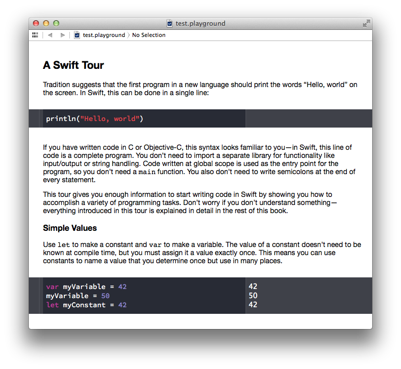

# Swift Playground Builder

> Create Xcode Playgrounds for the Swift programming language with rich documentation generated from Markdown



## Markdown Format

Swift code is extracted from the Markdown with the same syntax used to specify languages for code blocks in GitHub-flavored Markdown. All other text is parsed normally as Markdown using [marked](https://github.com/chjj/marked).

    # A Swift Tour

    Tradition suggests that the first program in a new language should print the words "Hello, world"
    on the screen. In Swift, this can be done in a single line:

    ```swift
    println("Hello, world!")
    ```

## Install

1. This tool requires [Node.js](http://nodejs.org). Download the installer from the Node.js website and follow the instructions.

2. In your Terminal, run the following command to install the Playground Builder:

   ```sh
   $ npm install -g swift-playground-builder
   ```

3. That's it! You should now be able to use the `playground` command.

## Command-line Usage

```
Usage: playground <paths>... [options]

paths     Markdown files(s), or directory containing Markdown files,
          from which to build the Playground(s)

Options:

   -d, --destination   Directory in which to output the Playground(s);
                       defaults to the current working directory

   -p, --platform      Specifies which platform's frameworks can be imported
                       in the Playground(s); only one platform can be choosen
                       [options: ios, osx] [default: osx]

   -n, --noreset       Don't allow edited code to be reset from the
                       "Editor → Reset Playground" menu in Xcode

   -v, --version       Print swift-playground-builder version and exit
```

## Node.js Usage

You can also import the Playground Builder as a Node.js module.

```js
var buildPlayground = require('swift-playground-builder');
```

### Arguments

* `paths` (`String` or `Array`, required)
  Path to Markdown file or directory containg Markdown files. An array of file and/or directory paths is also acceptable.

* `outputDirectory` (`String`, optional)
  Path to directory in which to output the built Playground(s). If not specified, the value of `process.cwd()` is used by default.

* `options` (`Object`, optional)
  See the "Options" section below for available options.

* `callback` (`Function`, optional)
  Function to be called once all Playground files have been output. First argument is `err` which contains an `Error`, if any.

### Options

* `allowsReset` (default: `true`)
  A Playground's code can be modified and saved. The Playground can be reset to its original code from the "Editor → Reset Playground" menu. This menu can be disabled for a Playground by setting this option to `false`.`

* `platform` (default: `osx`)
  Set the platform to `osx` or `ios` to be able to import each platform's respective frameworks.


### Example

```js
var buildPlayground = require('swift-playground-builder');

// outputs `Introduction.playground` to CWD
buildPlayground('Introduction.md');

// outputs `Variables.playground` to `/User/json/Playgrounds`
buildPlayground('Variables.md', '/User/jason/Playgrounds');

// outputs `Constants.playground` and `Closures.playground` to CWD
buildPlayground(['Constants.md', 'Closures.md'], {
  allowsReset: false,
  platform: 'ios'
});

// outputs playgrounds for Markdown files in `./playgrounds` directory,
// then invokes callback function
buildPlayground(['./playgrounds'], function(err) {
  if (err) { throw err; }
  console.log('Done building playgrounds!');
});
```

## License

The MIT License

Copyright (c) 2014 Jason Sandmeyer

Permission is hereby granted, free of charge, to any person obtaining a copy of this software and associated documentation files (the "Software"), to deal in the Software without restriction, including without limitation the rights to use, copy, modify, merge, publish, distribute, sublicense, and/or sell copies of the Software, and to permit persons to whom the Software is furnished to do so, subject to the following conditions:

The above copyright notice and this permission notice shall be included in all copies or substantial portions of the Software.

THE SOFTWARE IS PROVIDED "AS IS", WITHOUT WARRANTY OF ANY KIND, EXPRESS OR IMPLIED, INCLUDING BUT NOT LIMITED TO THE WARRANTIES OF MERCHANTABILITY, FITNESS FOR A PARTICULAR PURPOSE AND NONINFRINGEMENT. IN NO EVENT SHALL THE AUTHORS OR COPYRIGHT HOLDERS BE LIABLE FOR ANY CLAIM, DAMAGES OR OTHER LIABILITY, WHETHER IN AN ACTION OF CONTRACT, TORT OR OTHERWISE, ARISING FROM, OUT OF OR IN CONNECTION WITH THE SOFTWARE OR THE USE OR OTHER DEALINGS IN THE SOFTWARE.
